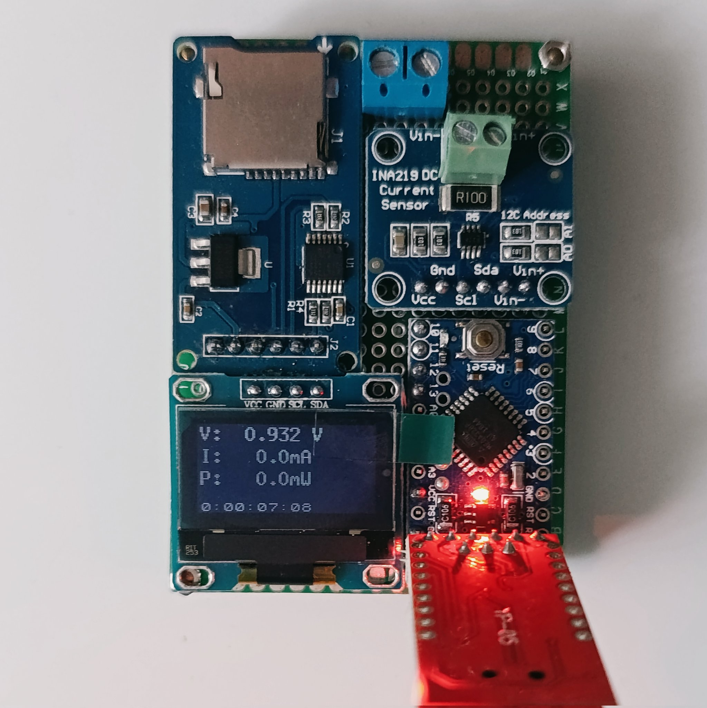

# Arduino INA219 Power Meter & Datalogger

Kód pro spolehlivý měřák napětí, proudu a výkonu. Původně vycházím z projektu, který před lety ukázal youtuber GreatScott. Jeho základní hardwarové zapojení bylo fajn, ale s jeho verzí softwaru a ořezanými funkcemi jsem prostě nebyl spokojený. Takže tohle je výsledek – napsané tak, aby to běželo stabilně, nezasekávalo se to a bez problémů se to vešlo do malé paměti Arduina Pro Mini.

## Hardware
* Arduino Pro Mini
* INA219 (měřicí modul, I2C komunikace napřímo bez velkých knihoven)
* OLED displej SH1106 (používá knihovnu U8x8)
* Modul pro micro SD kartu (SPI)
* Fyzické tlačítko

## Hlavní funkce
* **Chytré logování na SD:** Kód ukládá hodnoty, jen když dojde k jejich změně (delta logging), takže nevytváří zbytečně obří soubory. Má auto-recovery – pokud paměťovka ztratí kontakt, měřák nezatuhne a po chvíli se ji sám pokusí znovu inicializovat.
* **Tříbodová kalibrace:** Průvodce kalibrací přes sériovou linku (lineární regrese). Koeficienty se ukládají bezpečně do EEPROM. Možnost továrního resetu stiskem klávesy 'Z'.
* **Fyzické tlačítko:** Krátký stisk vloží do logu textovou značku (marker) pro pozdější analýzu v PC. Dlouhé podržení vynuluje naměřená minima a maxima. Celé je to napsané bez `delay()`, takže tlačítko neblokuje měření.
* **Peak-hold displej:** OLED ukazuje aktuální hodnoty, drží si minimální napětí a má grafický pruh, který chytá a pomalu pouští proudové špičky.

## Zapojení
INA219 a displej sdílí I2C sběrnici. Modul SD karty je na standardním SPI. Tlačítko je připojené na pin 2 (využívá interní pull-up, spíná proti GND).
